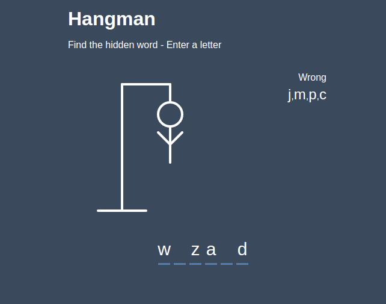

# Hangman
Classic game of hangman built on [React](https://reactjs.org/). Users can play by typing and see the html elements pop up as they guess correctly or incorrectly.

## Getting Started
- Fork and Clone the repository.  
- `npm install` into your local.
- `npm start` will start at http://localhost:3000.
- Have fun, play around.